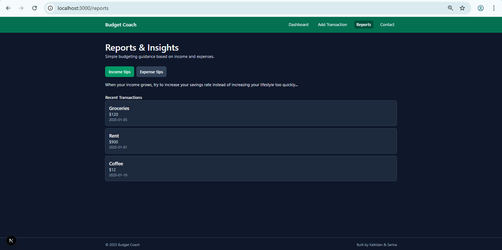
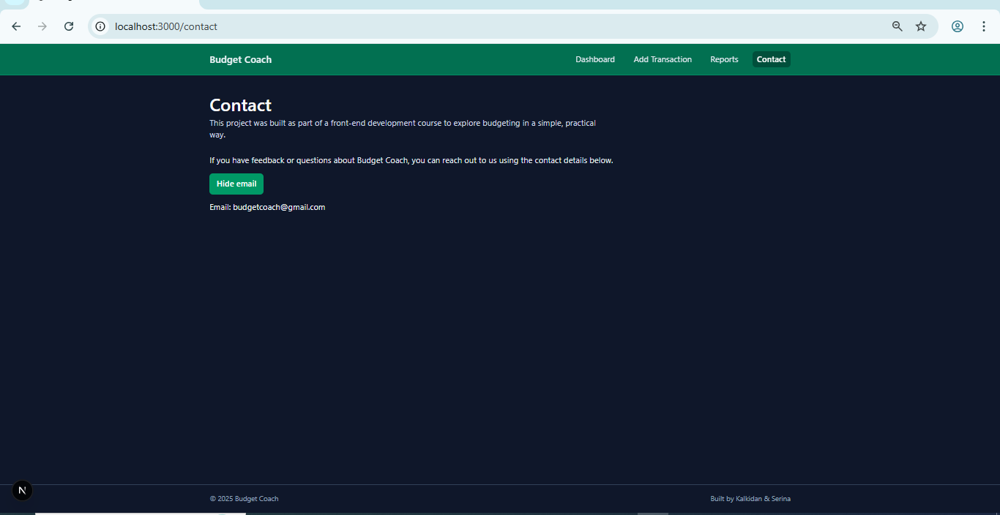

# Budget Coach  
A simple budgeting dashboard built with Next.js and React. The project helps students and small business owners get a clear overview of their income, expenses, and savings goals. This application was created as part of a front-end development course to practice routing, component structure, styling, and state management.

##  Project Structure

### **Main Routes**
| Route | Description |

| `/` | Dashboard showing income, expenses, and balance (monthly/weekly). Includes interactive state toggle. |
| `/add` | Page where users enter income, expenses, and savings goal. Displays a summary and personalized “coach tip.” |
| `/reports` | Interactive page providing budgeting tips. Users toggle between income and expense insights. |
| `/contact` | Shows project contact details with a "show/hide email" interactive element. |
| `/about` | Information about the purpose of the project with a show/hide section for project details. |

##  Components

### **NavBar**
Provides navigation between all pages. Highlights the active route using conditional styling.

### **PageHeader**
Reusable component that displays a page title and subtitle across all pages for consistent layout.

### **SummaryCard**
Styled card component used to display dashboard values (income, expenses, balance) with conditional colors.

### **TransactionForm**
Form component used on the `/add` page. Accepts user input and passes calculated data to the parent through the `onCalculate` callback.

### **Footer**
Global footer displayed across all pages.

### **TransactionList**
 Display fe information which will later be replaced by API.

---

##  State Management

The project uses React’s `useState` hook to manage user interactions and dynamic content:

- **Dashboard (`/`)**: Toggles between monthly and weekly view using state (`view`).
- **Add Page (`/add`)**: Stores calculated summary results in state and conditionally displays them.
- **Reports Page (`/reports`)**: Uses state to switch between income and expense tips.
- **Contact Page (`/contact`)**: Toggles email visibility using state (`showEmail`).

State is used to manage UI visibility, store form values, trigger calculations, and render conditional content.

---

##  Styling & Theme

The project uses **Tailwind CSS** for styling, providing:

- Responsive layout  
- Consistent dark theme  
- Conditional button and card styling  
- Clean, modern UI design  

---

##  Screenshots

### dashboard page

### Add Transaction Page

### Reports Page

### Contact Page

